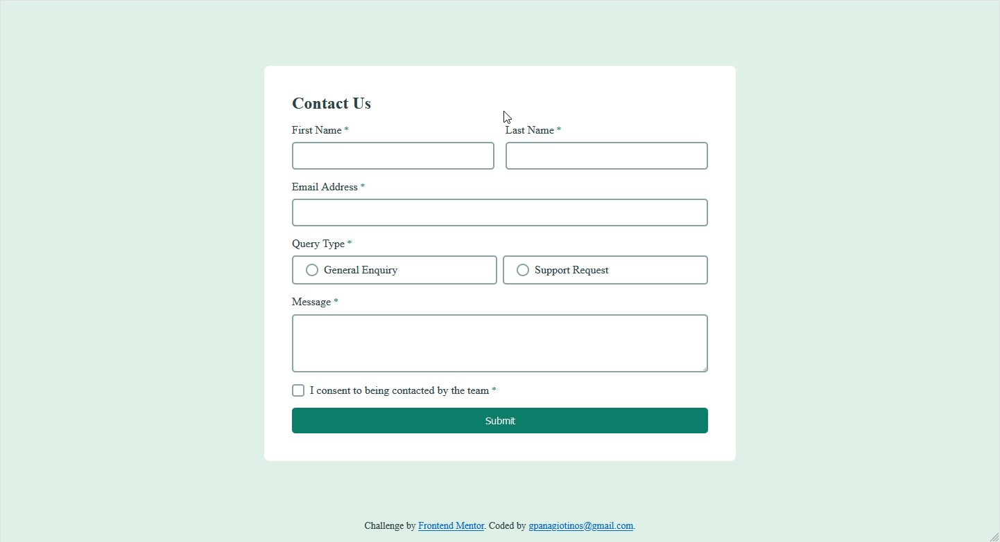
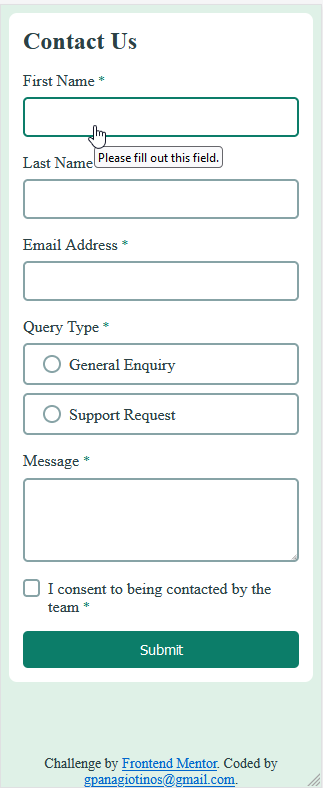
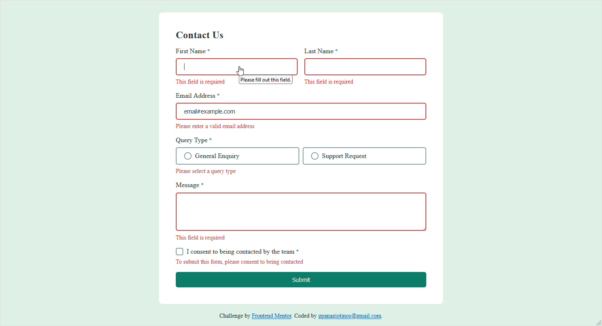
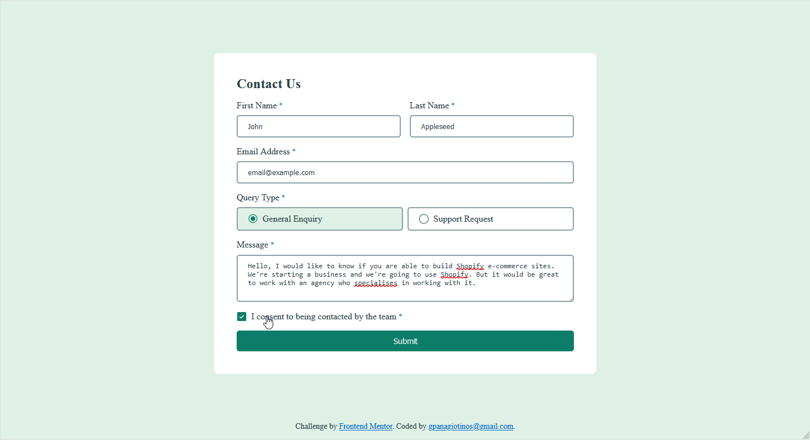
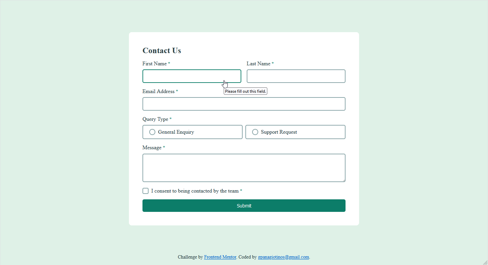
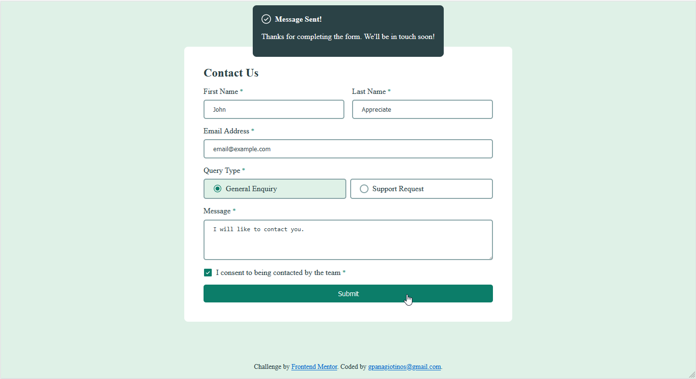

# Frontend Mentor - Contact form solution

This is a solution to the [Contact form challenge on Frontend Mentor](https://www.frontendmentor.io/challenges/contact-form--G-hYlqKJj). Frontend Mentor challenges help you improve your coding skills by building realistic projects.

## Table of contents

- [Frontend Mentor - Contact form solution](#frontend-mentor---contact-form-solution)
  - [Table of contents](#table-of-contents)
  - [Overview](#overview)
    - [The challenge](#the-challenge)
    - [Screenshot](#screenshot)
    - [Links](#links)
  - [My process](#my-process)
    - [Built with](#built-with)
    - [What I learned](#what-i-learned)
    - [Useful resources](#useful-resources)
  - [Author](#author)

**Note: Delete this note and update the table of contents based on what sections you keep.**

## Overview

### The challenge

Users should be able to:

- Complete the form and see a success toast message upon successful submission
- Receive form validation messages if:
  - A required field has been missed
  - The email address is not formatted correctly
- Complete the form only using their keyboard
- Have inputs, error messages, and the success message announced on their screen reader
- View the optimal layout for the interface depending on their device's screen size
- See hover and focus states for all interactive elements on the page

### Screenshot








### Links

- Solution URL: [Github](https://github.com/gpanagiotinos/contact-form-main)
- Live Site URL: [Github Pages](https://gpanagiotinos.github.io/contact-form-main/)

## My process

### Built with

- Semantic HTML5 markup
- CSS custom properties
- Flexbox
- CSS Grid
- CSS Selectors
- CSS Media Queries
- Javascript
- CSS Animations

### What I learned

For this Frontend Mentor challenge, I created a form and gained hands-on experience with HTML forms, including using inputs and validating form data using JavaScript and CSS selectors like :valid and :invalid. I also honed my CSS skills by using Grid and Flexbox to create a responsive layout that adapts to different screen sizes. Furthermore, I learned how to manipulate labels for inputs using CSS and JavaScript. Additionally, I focused on accessibility by creating a form that is usable by keyboard-only users and screen reader users, utilizing HTML and CSS to ensure a seamless experience for users with different disabilities.

```html
<div class="input-container grid-col-span-2">
  <label class="label-required" for="queryType">Query Type</label>
  <div class="radio-container">
    <input
      type="radio"
      id="generalEnquiry"
      name="query_type"
      value="General Enquiry"
      required
    />
    <label
      id="label-generalEnquiry"
      for="generalEnquiry"
      class="input-radio-container"
    >
      <span class="checkmark"></span>
      General Enquiry
    </label>
    <input
      type="radio"
      id="supportRequest"
      name="query_type"
      value="Support Request"
      required
    />
    <label
      id="label-supportRequest"
      for="supportRequest"
      class="input-radio-container"
    >
      <span class="checkmark"></span>
      Support Request
    </label>
    <span id="queryType-error" class="grid-col-span-2 error none"
      >Please select a query type</span
    >
  </div>
</div>
```

```css
input:valid ~ .error,
textarea:valid ~ .error {
  display: none;
}
input:invalid.error,
textarea:invalid.error {
  border-color: var(--red);
  outline-color: var(--red);
}
input[type="radio"]:checked + label .checkmark {
  background-image: url("../images/icon-radio-selected.svg");
  background-repeat: no-repeat;
  background-position: center;
  background-size: 16px;
  border-color: transparent;
}
```

```js
function validateForm() {
  const firstName = document.forms["contact-us"]["First Name"].value;
  const lastName = document.forms["contact-us"]["Last Name"].value;
  const email = document.forms["contact-us"]["emailAddress"].value;
  const queryType = document.forms["contact-us"]["query_type"].value;
  const message = document.forms["contact-us"]["message"].value;
  const consentType = document.forms["contact-us"]["consent_type"].checked;
  hasErrorText("firstName", firstName);
  hasErrorText("lastName", lastName);
  hasErrorText("message", message);
  hasErrorText("queryType", queryType);
  hasEmailError(email);
  hasErrorCheckbox("consent", consentType);
  return;
}
function hasErrorText(id, value) {
  const element = document.getElementById(`${id}-error`);
  const inputEl = document.getElementById(id);
  if (inputEl) {
  }
  if (value === null || value === "") {
    element.classList.remove("none");
    inputEl ? inputEl.classList.add("error") : "";
  } else {
    element.classList.add("none");
    inputEl ? inputEl.classList.remove("error") : "";
  }
  return;
}
```

### Useful resources

- https://developer.mozilla.org/en-US/docs/Learn/CSS/CSS_layout/Flexbox
- https://www.w3schools.com/css/css_form.asp
- https://www.w3schools.com/cssref/css_selectors.php
- CSS Grid Tutorial [@KevinPowell Learn CSS Grid the easy way](https://www.youtube.com/watch?v=rg7Fvvl3taU)


## Author

- Website - [Georgios Panagiotinos](https://code.panagiotinos.com/)
- Frontend Mentor - [@gpanagiotinos](https://www.frontendmentor.io/profile/gpanagiotinos)
- Github - [@gpanagiotinos](https://github.com/gpanagiotinos)

